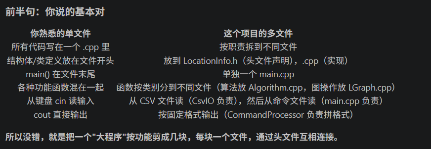
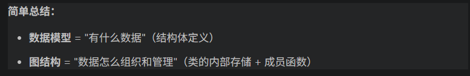

# Campus_navigation

## 9.1

## 9.2

### 对话 1：<从何下手>
**场景**：解决不知道从哪里开始写的问题

**我的提示词（原文摘录）**：
> 我写这个程序一般分几个部分？

> 相当于我平时写一个文件的那种程序，但输入拆到读写，输出在main函数，定义类单独一个文件，实现类的成员函数各自有文件？但是图结构和数据模型分别是什么意思？

**AI 回应要点**（无需贴全文，摘录关键段或截图均可）：
>
```
┌─────────────────────────────────────┐
│          第六层：main.cpp           │  程序入口
├─────────────────────────────────────┤
│      第五层：CommandProcessor       │  命令解析与分发
├─────────────────────────────────────┤
│     第四层：Algorithm               │  图算法
├────────────┬────────────────────────┤
│ 第三层：   │  第二层：              │
│ CsvIO      │  LGraph (核心)         │  文件读写 + 图存储
├────────────┴────────────────────────┤
│     第一层：LocationInfo            │  数据模型
│            GraphException           │  异常
└─────────────────────────────────────┘
```

>




**我的处理**：[接受]

**理由**：感觉AI的提议没什么问题

### 对话 2：<LGraph和CsvIO的对接>
**场景**：你为什么去问 AI（解决什么问题 / 探讨什么决策？）
**我的提示词（原文摘录）**：
> ……
**AI 回应要点**（无需贴全文，摘录关键段或截图均可）：
> ……
**我的处理**：[接受 | 修改后采纳 | 拒绝 | 部分采纳]
**理由**：……

### 对话 2：<CsvIO怎么写>
**场景**：你为什么去问 AI（解决什么问题 / 探讨什么决策？）
**我的提示词（原文摘录）**：
> ……
**AI 回应要点**（无需贴全文，摘录关键段或截图均可）：
> ……
**我的处理**：[接受 | 修改后采纳 | 拒绝 | 部分采纳]
**理由**：……

### 对话 2：<unordered_map怎么用>
**场景**：AI给出的储存建议是unordered_map，但我没用过这个STL库
**我的提示词（原文摘录）**：
> unordered_map是储存什么的，一般用在什么场景？考虑图的邻接存储场景，这个会怎么用？
**AI 回应要点**（无需贴全文，摘录关键段或截图均可）：
> unordered_map<int, vector<int>> graph;  // 键=节点，值=邻居列表
**我的处理**：[接受]
**理由**：感觉还挺好用的