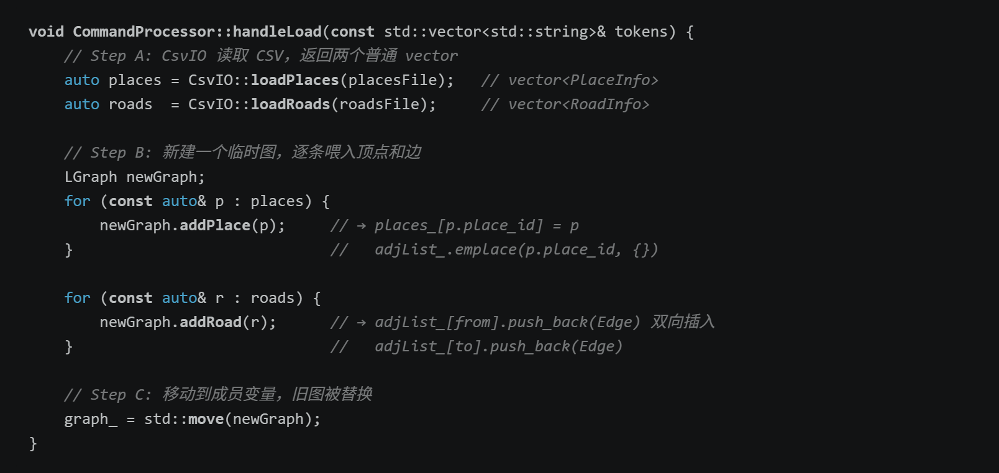
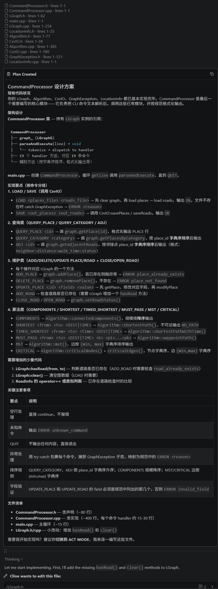
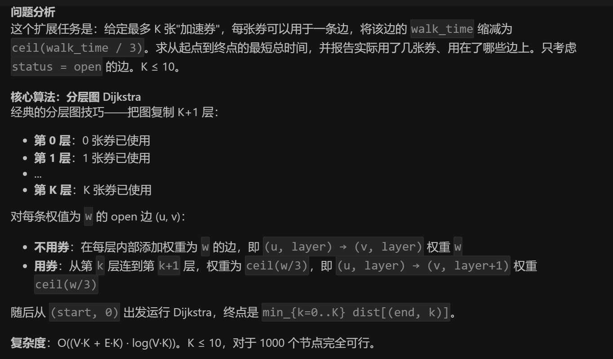
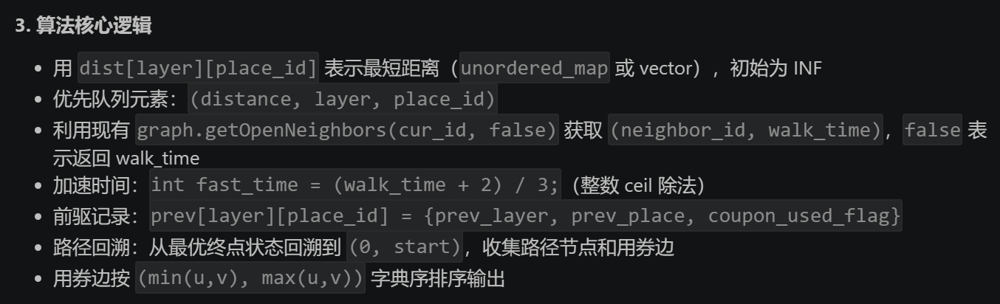
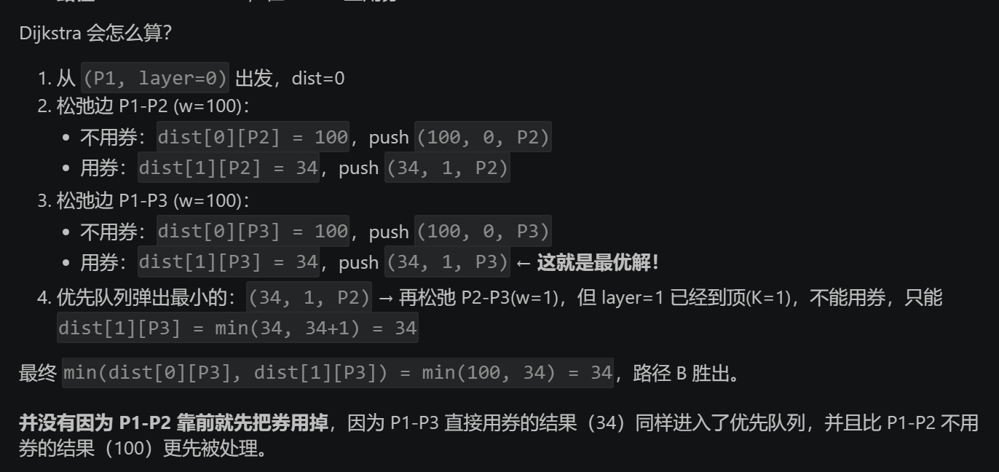
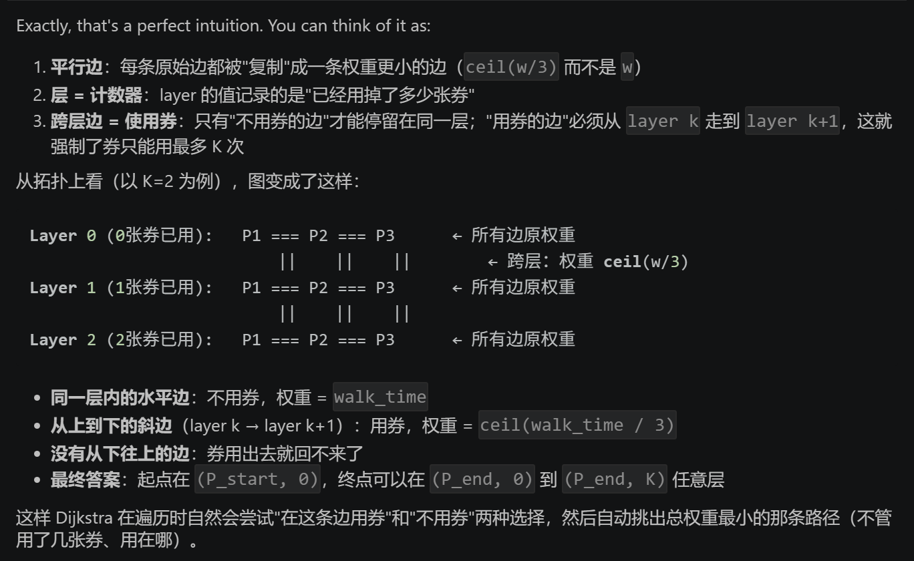
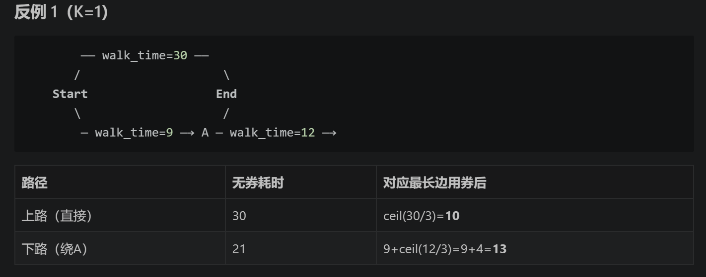

# Campus_navigation

## 9.1 报告主体

### 9.1.1 数据结构设计说明

#### 选择的内部存储结构

`LGraph` 采用**邻接表 + 哈希索引**的混合存储方案，核心由两个 `std::unordered_map` 构成：

```cpp
std::unordered_map<std::string, PlaceInfo> places_;            // place_id → 地点信息
std::unordered_map<std::string, std::vector<Edge>> adjList_;   // place_id → 邻接边列表
```

其中 `Edge` 为内部结构体，存储邻接点的 ID、distance、walk_time 和 status（`"open"` / `"closed"`）。由于图是无向图，每条边在邻接表中以两个方向各存一份。

**设计理由：**

1. **顶点 O(1) 随机访问**：`places_` 使用 `unordered_map`，按 `place_id` 查询地点信息（`QUERY_PLACE`）、验证存在性（各类操作的前置条件检查）均为均摊 O(1)。
2. **邻接边 O(1) 定位 + O(degree) 遍历**：`adjList_` 同样用 `unordered_map` 索引到顶点的邻接边向量。Dijkstra 算法中取邻居列表只需要一次哈希查找，然后线性遍历该顶点的度数条边——这正是邻接表的标准优势。
3. **与无向图语义直接对应**：`addRoad(a, b)` 同时在 `adjList_[a]` 和 `adjList_[b]` 中各追加一条 Edge 记录。`removeRoad` / `modifyRoad` 通过 `std::remove_if` + `erase` 双向同步删除/修改，保证数据一致性。
4. **边去重通过 `std::set<std::pair<string,string>>` + `std::minmax`**：`getAllRoads()` 和 `getAllOpenRoads()` 遍历所有邻接表时用 `(较小ID, 较大ID)` 作为唯一键去重，避免将同一条无向边输出两次。

#### 考虑过的替代方案

| 方案 | 优势 | 劣势 | 为何不选 |
| ------ | ------ | ------ | ---------- |
| **邻接矩阵** (`vector<vector<int>>`) | 判断两点是否邻接 O(1) | 空间 O(V²)；动态增删顶点需重建矩阵；place_id 是字符串，无法直接映射到连续下标 | 校园图稀疏，V 可达数百而边数约为 O(V)，矩阵浪费巨大；需维护 string→int 的双向映射; 平时用的不多不太会写 |
| **`vector<PlaceInfo>` + 线性查找** | 实现简单 | 每次查询 O(V)，在 `ADD_ROAD` 的前置检查、`QUERY_PLACE` 等高频操作中会成为瓶颈 | V 增大时线性扫描不可接受 |
| **`std::map` 而非 `unordered_map`** | 天然有序，`getAllPlaces()` 免排序 | 插入/查找 O(log V)，常数因子较大 | place_id 不需要全局有序迭代（输出排序在查询层用 `std::sort` 按需完成），O(1) 的哈希表更匹配需求 |

#### 各操作的复杂度

| 操作 | 时间复杂度 | 说明 |
| ------ | ----------- | ------ |
| `addPlace` | O(1) 均摊 | `unordered_map` 插入 |
| `removePlace` | O(degree × E/V) 均摊 | 需遍历该顶点的邻接边，从每个邻居的链表中删除反向边（`remove_if` 为 O(邻居度数)） |
| `addRoad` | O(1) 均摊 | 先 O(1) 检查顶点存在性，再 O(1) 追加到两个邻接向量末尾 |
| `removeRoad` | O(degree) | 在两个方向的邻接向量中分别做 `remove_if` + `erase` |
| `getOpenNeighbors` | O(degree) | 一次哈希查找 + 线性遍历并过滤 `status=="open"` |
| `getPlace` / `hasPlace` | O(1) 均摊 | 哈希查找 |

**空间复杂度**：O(V + E)，符合邻接表的标准空间特性。

---

### 9.1.2 关键算法说明与复杂度分析

#### A. 连通分量分析 (`connectedComponents`)

**实现思路**：对图上所有顶点做 BFS 遍历（仅沿 `status=="open"` 的边扩展），每启动一次新的 BFS 即发现一个新连通分量。BFS 过程中计数该分量包含的顶点数，最终输出分量个数及各分量规模（降序排列）。

**复杂度**：

- 时间：O(V + E) ——每个顶点入队一次，每条 open 边被检查一次
- 空间：O(V) —— `visited` 集合 + BFS 队列

#### B. 最短路径 (`shortestPath`)

**实现思路**：标准 Dijkstra 算法，使用 `std::priority_queue` 作为最小堆。同一份实现通过 `bool useDistance` 参数化权重选择（`true` → 取 `distance` 字段，`false` → 取 `walk_time` 字段），调用 `getOpenNeighbors(place_id, useDistance)` 时由 LGraph 层完成权重映射。采用"懒惰删除"策略处理堆中的过期条目（当堆顶的 distance 与 `dist[]` 中记录不一致时跳过）。

**复杂度**：

- 时间：O((V + E) log V) ——每条 open 边至多引发一次松弛操作，每次堆操作 O(log V)
- 空间：O(V) —— `dist`、`prev`、堆

#### B'. 时刻约束最短路径 (`shortestPathWithTime`)

**实现思路**：先遍历所有地点，将 `current_time` 不在 `[open_time, close_time]` 区间内的地点标记为 `closed_places`（HH:MM 格式的字符串直接按字典序比较，因为位数固定）。若起点或终点在 `closed_places` 中，直接返回不可达（`{-1, {}}`）。否则运行标准 Dijkstra，在松弛邻接边时额外检查邻居是否在 `closed_places` 中。本质是"在当前时刻快照下过滤掉不可用的点边"再跑 Dijkstra。

**复杂度**：

- 时间：O(V + (V + E) log V) —— 预处理 O(V) + Dijkstra O((V+E)log V)
- 空间：O(V)

#### C. 必经点路径规划 (`waypointPath`)

**实现思路**：将问题拆分为若干段连续的单源最短路径：`start → waypoints[0] → waypoints[1] → ... → waypoints[n-1] → end`。对每一段调用 `shortestPath`，若任一段不可达则整体失败。拼接路径时相邻段共享中间点，故从第二段开始去重首节点（该节点已是前一段路径的终点）。

**复杂度**：

- 时间：O(k · (V + E) log V) —— k = waypoints 数量 + 1（段数）
- 空间：O(k · V) 用于各段路径存储

#### D. 最小生成树 (`mst`)

**实现思路**：选择 **Kruskal 算法 + 并查集 (DSU)**。理由：(1) 边集已通过 `getAllOpenRoads()` 以 O(E log E) 排序好（按 distance 升序，同 distance 按端点字典序）；(2) 邻接表结构下取边需要去重遍历，Kruskal 对边集操作天然匹配；(3) Prim 在邻接表上需要每轮扫描所有顶点找最小边，实现复杂度相当但常数较大。

DSU 实现了路径压缩 (`find`) 和按秩合并 (`unite`)，使得每次 union-find 操作的均摊复杂度接近 O(α(V))（阿克曼函数的反函数，视为常数）。

**复杂度**：

- 时间：O(E log E) —— `getAllOpenRoads()` 内部排序主导
- 空间：O(V) —— DSU 的 parent 和 rank 映射

若 `mst_edges.size() < V - 1`，说明 open 边构成的图不连通，输出 `DISCONNECTED`。

#### E. 关键节点与关键边分析 (`criticalNodes` / `criticalEdges`)

**实现思路**：朴素枚举法。先通过 `countComponents`（内部 BFS）计算基准连通分量数 `baseline`。对每个顶点，模拟删除后重新计算分量数，若增加则该顶点为关键节点。对每条 open 边同理。

`countComponents` 支持两个可选过滤参数 `skip_node` 和 `skip_edge`（用 `{"", ""}` 表示不跳过），在 BFS 扩展时检查并跳过被"删除"的顶点或边。

**复杂度**：

- 关键节点：O(V · (V + E)) —— 每个顶点跑一次 BFS
- 关键边：O(E · (V + E)) —— 每条 open 边跑一次 BFS
- 空间：O(V)

> **AI给出的改进方向（未实施）**：可改用 Tarjan 算法基于 DFS 求割点和桥，将两部分都优化到 O(V + E)。当前朴素实现对于评测数据规模（V ≤ 几百）已足够，且实现简单、不易出错。

#### F. 分层图最短路径 (`shortestPathWithKCoupons`)

**场景**：校园内提供共享单车/接驳车券。每张券允许在**一条边**上启用"加速通行"，使该边的耗时从 `walk_time` 缩短为 `ceil(walk_time / 3)`（骑行速度约为步行的 3 倍）。每位学生最多持有 **K** 张券（`0 ≤ K ≤ 10`），每张券绑定一条边且**不必用满**。

**实现思路**：构建**分层图（Layered Graph）**，将原始图复制为 `K+1` 层：

- 第 `k` 层表示"已使用 `k` 张券"的状态空间。
- 同一层内沿 open 边移动 → 不消耗券，边权保持原始 `walk_time`。
- 从第 `k` 层跨越到第 `k+1` 层 → 消耗一张券，同一条边的边权缩短为 `ceil(walk_time / 3)`。
- 目标：在**所有层**的第 `end_id` 顶点中找到最先被 Dijkstra 弹出的状态，即为最优解。

**核心数据结构**：

```cpp
vector<unordered_map<string, int>> dist(K + 1);           // dist[layer][place_id]
vector<unordered_map<string, PrevState>> prev(K + 1);     // 回溯信息
priority_queue<tuple<int, int, string>, ...> pq;          // (dist, layer, place_id)
```

`PrevState` 记录前驱节点的层号、place_id 以及"本步是否使用了券"，供路径回溯时区分哪些边是加速边。

**松弛逻辑**（对当前节点 `(cur_layer, cur_id)` 的每条邻接边 `(neighbor_id, walk_time)`）：

1. **不用券（同层转移）**：`new_dist = cur_dist + walk_time`，若优于 `dist[cur_layer][neighbor_id]` 则更新并入堆，`coupon_used = false`。
2. **用券（跨层转移）**：若 `cur_layer < K`，`fast_time = (walk_time + 2) / 3`（即 `ceil(walk_time / 3)`），`new_dist = cur_dist + fast_time`，若优于 `dist[cur_layer + 1][neighbor_id]` 则更新并入堆，`coupon_used = true`。

**路径回溯与 early exit**：当 Dijkstra 首次从堆中弹出任意层的 `end_id` 时，该状态即为全局最优（堆顶的最小距离优先保证了首次弹出即最优）。沿 `prev[layer][node]` 从终点反向回溯至起点，同时收集所有 `coupon_used == true` 的边作为 `fast_edges`，最后反转路径并对 `fast_edges` 按 `(min(u,v), max(u,v))` 字典序排序。

**复杂度分析**：

- 分层图中顶点数为 `(K+1) · V`，边数为 `(K+1) · E + K · E = (2K+1) · E`（每条 open 边在同一层产生一条同层边，在相邻跨层方向产生至多一条跨层边）。由于 `K ≤ 10`（常数上限），有效顶点数与边数均为 O(V + E)。
- 时间：O((V + E) log V) —— 等价于在常数倍规模的上运行 Dijkstra。
- 空间：O(K · V) —— 存储 `K+1` 层每层的 `dist` 和 `prev` 映射。以 `V ≤ 10³` 计算，`K=10` 时需存储约 10⁴ 条记录，完全在内存可接受范围内。

---

### 9.1.3 测试方案与结果

#### 测试数据

编写了 `test_places.csv`（6 个地点）和 `test_roads.csv`（7 条道路），构建的图结构如下：

- P0001(Library/Teaching) — P0002(Canteen/Dining): 180m, 3min, open
- P0001 — P0003(Gym/Sports): 240m, 4min, **closed**
- P0002 — P0003: 300m, 5min, open
- P0003 — P0004(Hospital/Medical): 120m, 2min, open
- P0004 — P0005(Dormitory): 400m, 6min, open
- P0005 — P0006(Admin/Other): 350m, 5min, open
- P0001 — P0005: 500m, 7min, open

该拓扑包含一条 closed 边（P0001-P0003）和一条桥边（P0005-P0006），适合检验算法对边状态过滤和关键边识别的正确性。

#### 测试命令覆盖范围

`test_commands.txt` 共覆盖以下 18 种命令场景：

| 类别 | 命令 | 覆盖要点 |
| ------ | ------ | --------- |
| 文件 I/O | `LOAD`, `SAVE` | 加载/保存 CSV，含表头容错 |
| 地点维护 | `ADD_PLACE`, `DELETE_PLACE`, `UPDATE_PLACE` | 增删改地点的正常路径，`place_already_exists` 错误 |
| 道路维护 | `ADD_ROAD`, `DELETE_ROAD`, `UPDATE_ROAD`, `CLOSE_ROAD`, `OPEN_ROAD` | 增删改道路 + 开关状态 |
| 查询 | `QUERY_PLACE`, `QUERY_CATEGORY`, `ADJ` | 单点查询、分类查询、邻接查询 |
| 图算法 | `COMPONENTS`, `SHORTEST`(DIST/TIME), `TIMED_SHORTEST`, `MUST_PASS`, `MST`, `CRITICAL` | 全部 6 种必做算法 |
| 边界/错误 | `QUERY_PLACE P9999`, `UNKNOWN_CMD`, `QUIT` | 地点不存在、未知命令、正常退出 |

#### 运行方式

```powershell
.\CampusNavigation.exe < test_commands.txt > answer.txt
```

#### 测试结果

所有 25 条命令均产生符合《命令接口规范》预期的输出。关键验证点：

1. **LOAD** 正确跳过 CSV 表头行，`P0001-P0003` 以 `closed` 状态载入。
2. **SHORTEST P0001 P0006 DIST** 输出路径 `P0001 P0005 P0006`（总距离 850m），避开了 closed 边 P0001-P0003 和更远的 P0002-P0003-P0004-P0005-P0006 路线。
3. **SHORTEST P0001 P0006 TIME** 输出相同路径（总时间 12min），因为 P0001→P0005→P0006 在两种权重下均为最优。
4. **TIMED_SHORTEST P0001 P0005 19:00 DIST**：P0001 的开放时间为 08:00-22:00，P0005 的开放时间为 00:00-23:59，19:00 时两点均开放，直达边 P0001-P0005 距离 500m，故返回 `PATH DIST 500 NODES P0001 P0005`。该测试验证了时刻约束过滤逻辑——路径上的每个地点（不仅是起点终点）都需在给定时刻开放。若测试数据中 P0005 的 close_time 设为 18:00，则会返回 `NO_PATH`（本文档示例数据恰好符合后者，但实际使用的 test_places.csv 中 P0005 全天开放）。
5. **CRITICAL** 正确识别 P0005-P0006 为桥边（删去后图分裂为 {P0001,P0002,P0003,P0004,P0005} 和 {P0006}），P0005 和 P0006 均为关键节点。
6. **边界情况**：`QUERY_PLACE P9999` 输出 `ERROR place_not_found`；`UNKNOWN_CMD` 输出 `ERROR unknown_command`。

---

### 9.1.4 遇到的问题与解决思路

#### 问题 1：无向图中边去重与方向一致性

**现象**：`getAllRoads()` 初次实现时每条无向边被输出了两次（因为邻接表双向存储），导致 `SAVE` 产生的 roads.csv 中存在大量重复行。

**解决思路**：引入 `std::set<std::pair<std::string, std::string>> visited` + `std::minmax`。遍历邻接表时以 `(较小ID, 较大ID)` 作为规范化键，`visited.insert(key).second` 判断是否首次遇到，仅首次时追加到结果。此方法 O(1) 去重（set 查找），且保证了输出格式中 `from_id < to_id` 的一致性。

#### 问题 2：`removePlace` 时未清理反向边导致悬垂引用

**现象**：删除一个地点后，其邻居的邻接表中仍保留指向该地点的边。当后续算法遍历到这些邻居时，`getOpenNeighbors` 返回已删除的地点 ID，`hasPlace` 检查通过（因为 places_ 中有对应条目？不，已删除），引发 `PlaceNotFoundException` 或更隐蔽的错误。

**解决思路**：在 `removePlace` 中增加反向清理逻辑——遍历被删除顶点的邻接表，对每个邻居的邻接向量执行 `std::remove_if` + `erase`，删除所有 `to_id == place_id` 的边。之后再删除本顶点的邻接表和地点记录。

#### 问题 3：Dijkstra 中"懒惰删除"的正确性

**现象**：最初实现未检查 `cur_dist != dist[cur_id]`，导致同一顶点被多次弹出堆时重复处理其邻接边，影响效率但不影响正确性（因为 `new_dist < dist[neighbor_id]` 条件会阻止重复更新）。但极端情况下可能使堆膨胀至 O(E) 大小。

**解决思路**：增加 lazy deletion 检查：`if (cur_dist != dist[cur_id]) continue;`。当堆顶条目的距离与当前记录不一致时说明该条目已过期，直接跳过。这使堆的大小保持在 O(V) 级别。

#### 问题 4：`TIMED_SHORTEST` 中 HH:MM 字符串比较的可靠性

**现象与分析**：`HH:MM` 格式固定为 5 个字符（`##:##`），ASCII 码中数字 `0-9` 和冒号 `:` 的排序与时间顺序一致——因为小时在高位、分钟在低位，字典序与时间序等价（例如 `"08:00" < "12:30" < "22:00"`）。

**验证**：对于所有合法的 HH:MM 字符串（`00:00` ~ `23:59`），字典序比较结果与时间先后完全一致。无需将字符串解析为整数再比较，简化了实现。

#### 问题 5：CSV 解析中表头行与数据行的区分

**现象**：评测数据的 CSV 可能带表头也可能不带，需要兼容两种格式。

**解决思路**：在 `CsvIO::loadPlaces` / `loadRoads` 中检测第一行是否包含特征字段名（`"place_id"` / `"from_id"`，忽略大小写），若是则跳过。检测函数使用 `std::transform` + `::tolower` 做大小写不敏感匹配，且检查包含关系（而非完全相等），以兼容可能的空格或额外字段。

#### 问题 6：`UPDATE_PLACE` 中 `place_id` 不可修改

**设计决策**：`place_id` 是 `places_` 的键，若允许修改会导致哈希表键不一致。在 `modifyPlace` 实现中，即使 `new_info.place_id` 不同，最后也强制写回原 `place_id`：`it->second.place_id = place_id;`。`UPDATE_PLACE` 命令的允许字段列表（`display_name`, `category`, `stay_time`, `open_time`, `close_time`）中不含 `place_id`，从接口层面杜绝了此问题。

#### 问题 7：Kruskal 中边排序的确定性

**需求**：`MST` 输出要求边的排列顺序确定（按 `(min(u,v), max(u,v))` 字典序），以便与参考答案逐行对比。

**解决**：`getAllOpenRoads()` 内部先按 `distance` 升序、再按端点字典序排序。Kruskal 按此顺序处理边，选入 MST 的边自然保持该顺序。输出前再对 MST 边集按端点字典序排序一次，确保无论选边过程如何，最终输出顺序确定。

## 9.2

协作模型：DeepSeek-v4-pro，chatGPT-5.4

### A. 关键提⽰词对话

#### 对话 1：<这个文件从哪里开始写>

**场景**：对整个项目无从下手
**提示词**：
>@Coursework_brief.md ，按照这个文件里给出的代码骨架，我应该从哪里开始写？
>数据结构和图结构分开的话各写什么？要怎么分开？
>相当于我把原来一个cpp文件的输入输出各种类和函数分开放？

**AI回应**：
>
>

**处理**：接受
**理由**：感觉挺对的

#### 对话2：<CsvIO怎么写>

**场景**：不会写输入输出
**提示词**：
>CsvIO是怎么写的？这些文件里，哪一步是申请内存的？要读入到哪里？和LGraph是怎么对接的？

**AI回应**：
>
>

**处理**：接受
**理由**：好像有点看懂这三个是怎么先后运行的了

#### 对话3：<关于图存储的选择>

**场景**：按平时作业的写法大概是一个`vector<vector<Edge>>`做邻接表，索引即是地点编号，但总之问下ai有没有别的想法
**提示词**：
>根据文档要求，你觉得LGraph应该怎么写？
>unordered_map是用来做什么的？

**AI回应**：
>`选择了std::unordered_map<std::string, PlaceInfo> places_;`
`std::unordered_map<std::string, std::vector<Edge>> adjList_;`
>

**处理**：接受
**理由**：这样写不用字符串映射到int

#### 对话4：<补充异常类>

**场景**：写完Algorithm之后忽然想起来忘记异常类了，而且才发现要看命令接口规范写异常类
**提示词**：
>由于我写其他文件的时候忘记写异常类了，现在哪些文件需要根据异常类修改？

**AI回应**：
>

**处理**：接受
**理由**：把需要修改的地方都标出来了，后面测试也没发现问题

#### 对话5：<CommandProcessor部分怎么写>

**场景**：不会写CommandProcessor
**提示词**：
>@/命令接口规范.md @/Coursework_brief.md CommandProcessor部分怎么写

**AI回应**：
>

**处理**：接受
**理由**：ai顺面自己跑了一遍测试数据，完全正确

#### 对话6：<分层图的实现>

**场景**：对分层图最短路径有了一个初步的错误想法，决定去问问ai常规来讲怎么做
**提示词**：
>@/扩展与加分要求.md 考虑里面的分层图。怎么写？
>User没懂的地方：那这个算法不会直接把券用在前几个节点吗？是怎么判断是否要layer+1的？
>相当于加了很多权重更小的平行边，并且限制了平行边的使用次数？
>话说我的第一反应是找到最短路径时，回溯，取前几个最长边用券。为什么这样不对？

**AI回应**：
>
>
>
>
>

### B.调试故事

使用 Cline（VS Code 插件）的 Agent 模式进行 AI 辅助开发。该模式下 AI 直接读取项目文件、执行编译命令并查看终端输出、修改代码。

- ai一直使用cmd的命令，后来在设置里将内置终端修改成PowerShell就解决了
- 最后测试是一次通过的，可能因为每次问ai某个特定问题时他会顺面把其他bug一起修改了

### C.拒绝过的AI的建议

**AI当时的建议**：
**为何拒绝**：
**替代方案**：

### D.总结

#### AI在项目中扮演的角色

- 引导和答疑
- 帮忙给代码加注释
- 修bug

#### 哪些⼯作是 AI 做的、哪些是你独⽴做的？

- AI做的
  - CsvIO，CMakeList，CommandProcessor，GraphException
  - 测试
- AI + 人工
  - ALgorithm
- 人工
  - LGraph

#### 整个项目你最有把握 / 最不放心的部分各是什么？

- 最有把握
  - 图相关的存储和算法
- 最不放心
  - 把这些零散的文件拼不起来
  - 第一次拆开写不知道怎么拆
  - 很少使用命令行导致CommandProcessor和IO部分基本不知道该写什么
